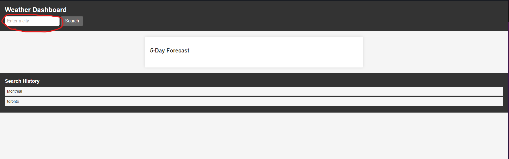
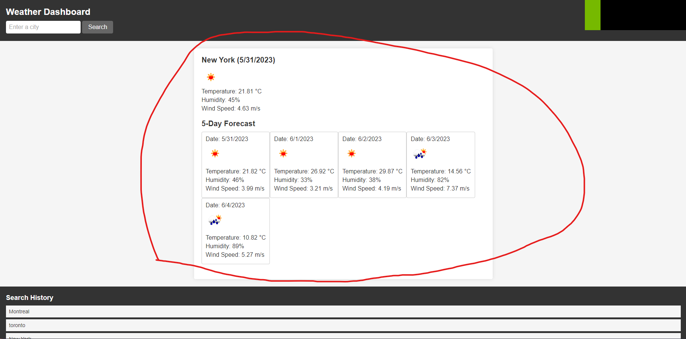
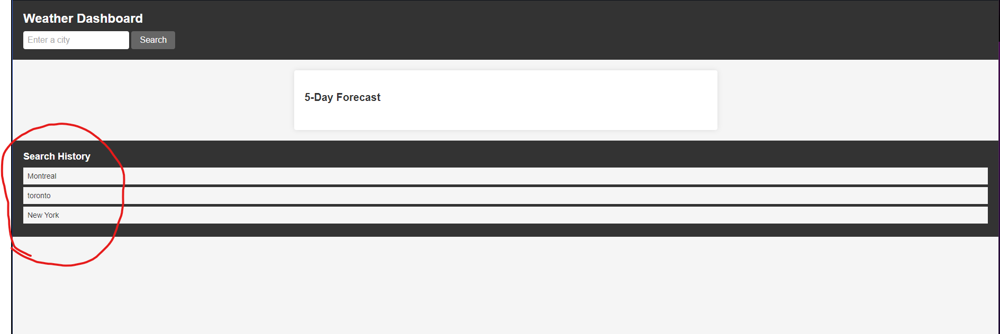

# <Weather Application>

## Description

- My motivation for this was to provide a streamline way for anyone to find out the info they need about the weather for their city, and a forecast as well!
- I built this project to further my understanding of third party Api's and to improve my knowledge of local storage.
- This will help anyone see the weather when needed.
- I learnt a lot more about the api keys and about local storage, as well as more logic.

## Installation

N/A

## Usage

In order to use the application, please head to the deployed website :
 https://senkua.github.io/WeatherApp/

 In the search bar shown in the picture below, type the name of the city you would like to see the forecast of.

After doing so, you will see a 5 day forecast as well as the current weather for the city you've searched as shown below. 

If you refresh or leave the page and go back, you will still see your previously searched cities in the search history as shown below. 

## Credits

I used Chat GPT for the Commenting and organization of this projects code a lot!
https://chat.openai.com

I used a website to test how it would run as well aside from VS , also to help with version control
https://replit.com/~

I referenced w3schools a lot for the local storage function.
https://www.w3schools.com/jsref/prop_win_localstorage.asp
as well as 
https://www.w3schools.com/js/js_api_web_storage.asp

## License

Refer to the License in the repository.